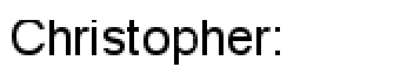
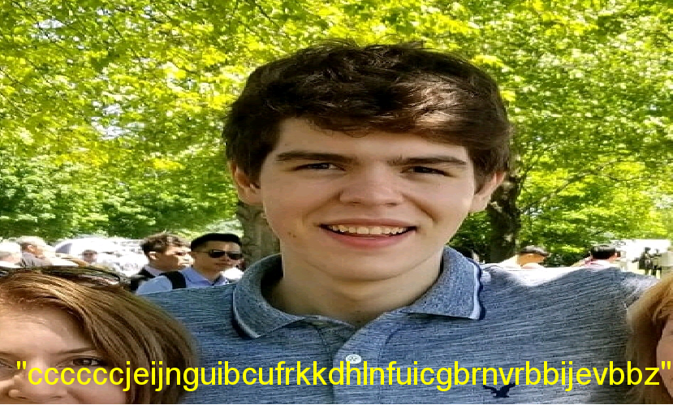
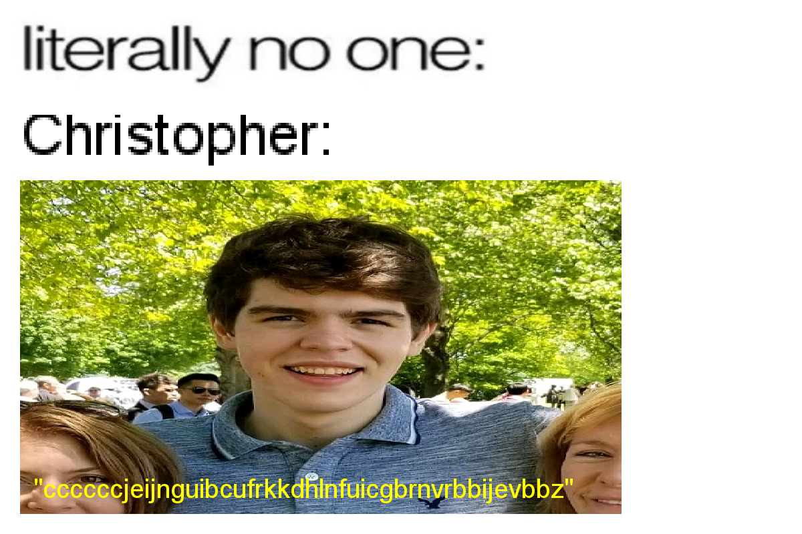

<p align="center">
  
  <h3 align='center'>YubikeyWatch</h3>
</p>

## What does this do?

This bot creates and posts **dank memes** whenever someone accidentally posts a Yubikey in a GroupMe thread.

## How does this work? (Technical Overview)

I have a GroupMe bot called "tHeYuBiKeYpOlIcE" with the Callback URL pointing to a heroku app that contains the code in this repo.

Whenever a new post is made in the specified GroupMe thread, a POST request is sent to the Callback URL containing a payload similar to the following:

```javascript
{
    "attachments": [],
    "source_guid": "REDACTED",
    "text": "Example Groupme post",
    "sender_id": "3981",
    "system": False,
    "id": "REDACTED",
    "user_id": "3981",
    "name": "Christopher L",
    "created_at": 1560389057,
    "sender_type": "user",
    "avatar_url": "REDACTED PROFILE PICTURE URL",
    "group_id": "4770"
}
```

I parse that payload and pull out the "text", "name", and "avatar_url" values.

I run the "text" value through *main.is_yubikey()*, which checks to see if the message matches the following regular expression:

```python
"^(c{6}\w{38})+$"
```

If it matches, that means that the message was posted with an accidental yubikey press.

After a message matches the regex value, I programatically create the dank meme by passing the "avatar_url" and "name" values to *main.create_image()*.

This function uses Python's Pillow library to write the user's first name to a blank canvas with size 40 arial font.  I take this canvas and enlarge it to simulate this blurry effect:

<p align="center">
  
</p>

Then I download the GroupMe user's profile picture and enlarge it *without* maintaining the aspect ratio.  I use Pillow again to write the "text" value on top of the user's profile picture.

<p align="center">
  
</p>

Then the program combines the 2 custom images with the template image to create something like this:

<p align="center">
  
</p>

## Example

<p align="center">
  
</p>
